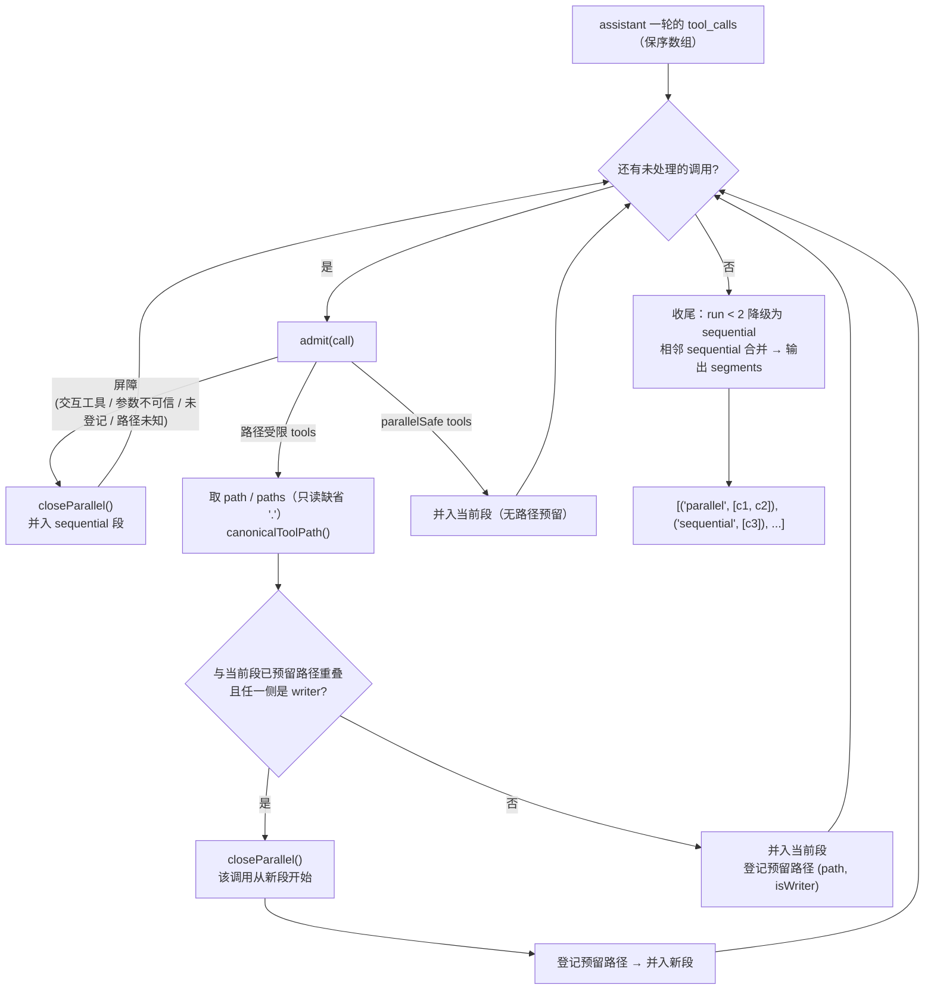
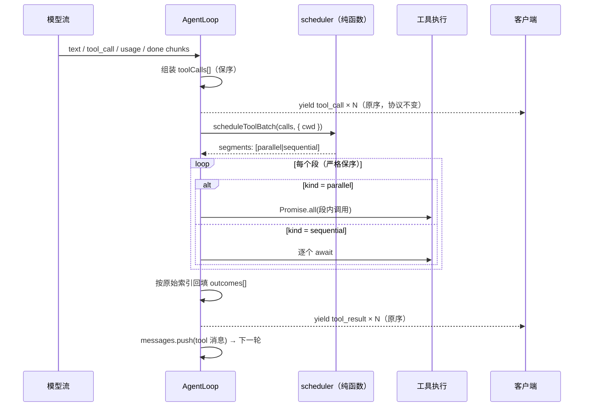

# Planner 深度解析（Hermes 机制 + one-agent 实现）

> ⚠️ **命名澄清（先读这一节，否则整篇都会被误读）**
>
> Hermes 内部把工具批的**执行调度**命名为 planner（`agent/tool_dispatch_helpers.py:_plan_tool_batch_segments`、`run_agent.py:_execute_tool_calls` 的 docstring 也写作 "The segment planner"）。但它是 **dispatch 调度器**：
> - 输入 = 模型**已经决定**要发出的这一批 tool_call；
> - 输出 = `[("parallel",[...]), ("sequential",[...])]`；
> - 唯一判断 = "这两个调用会不会碰同一个文件路径"。
>
> 它**不产生任何计划**：不决定做什么、不拆解任务、不排优先级、不做依赖推断、不重排调用顺序。
> 与"方案规划"（plan mode / todo / goal）**没有任何代码关系**。
>
> one-agent 因此把这个模块命名为 **`toolBatchScheduler`**（原 `toolBatchPlanner`，2026-09-20 改名），函数 `scheduleToolBatch`。
> 本文件名 `planner-deep-dive.md` 为兼容既有引用而保留。Hermes 的规划能力全景见 §5。
>
> 上游参考：`~/.hermes/hermes-agent/agent/tool_dispatch_helpers.py`（调度）、`agent/tool_executor.py`（执行）、`run_agent.py:1302`（入口）
> one-agent 实现：`one-agent-core/src/agent/toolBatchScheduler.ts`、`one-agent-core/src/agent/AgentLoop.ts`
> 测试：`one-agent-core/tests/agent/toolBatchScheduler.test.ts`、`tests/agent/toolBatchExecution.test.ts`

---

## 1. 要解决的问题

模型在一轮里可以同时发出多个 tool_call。无差别 `Promise.all` 会引入**真实竞态**：

| 场景 | 后果 |
|---|---|
| `read(a)` + `edit(a)` 同轮 | 读可能落在写前或写后，不确定。 |
| `edit(a)` + `edit(a)` 同轮 | `edit` 是「读 → 替换 → 写回」，两次并行 → **后写覆盖先写，丢更新**。 |
| `bash("rm -rf build")` + `read("build/x.js")` | 读到半删状态。 |
| `read(a)` + `read(b)` 同轮 | 完全安全，**应该并行**（省时延）。 |

所以需要的不只是"并行开关"，而是**按作用域判断谁可以和谁并行**的准入器。

---

## 2. 三段式机制

### 2.1 准入（admission）：每个调用归入一类

| 归类 | 判定 | 行为 |
|---|---|---|
| **屏障** | 交互类工具（`neverParallel`）；参数不是对象（解析失败 / null / 数组）；路径型工具但取不到路径；**未登记的工具**（含 `bash`/MCP/自定义工具） | 关闭当前段，该调用并入顺序段 |
| **路径受限** | `pathScopedReaders` / `pathScopedWriters` 命中，且能从 `path`/`paths` 取到路径 | 参与路径重叠判定 |
| **无路径并行安全** | `parallelSafe` 命中（纯只读、无共享可变状态） | 无条件并入并行段 |

one-agent 默认面板（`DEFAULT_SCHEDULER_TABLES`）：

```
neverParallel      = {}                                  （内置工具暂无交互类；扩展点）
pathScopedReaders  = { read, grep, find, ls, tree }
pathScopedWriters  = { write, edit }
parallelSafe       = { web_search, knowledge_search }
```

两个关键约定：

- **只读工具的 path 缺省值**要按工具 schema 对齐（`grep`/`find`/`tree` 默认 `"."` = 会话工作区根），否则"裸 grep"会被误判为路径未知而整批降级；
- **未登记 = 屏障**是保守正确：`bash` 的作用域不可静态判定，MCP 工具默认不并行（要 opt-in，通过 `tables` 覆盖显式加入）。

### 2.2 路径归一 + 重叠判定

归一：`~` 展开 → 相对 `cwd` resolve → **realpath（解 symlink）** → 去尾斜杠 → Windows 下小写。

重叠判定不是字符串相等，而是**路径段前缀比较**：`/a/b` 与 `/a/b/c` 视为重叠（写父目录会影响子目录）。

规则一句话：**读读可同段；任一侧是 writer 的重叠 → 关闭当前段**。这样"批量读"永远看不到"写了一半"的内容。

### 2.3 段组装：保序是关键约束

- 后来者永不跨越先到的屏障 → 分段执行与全串行执行的**副作用边界完全一致**；
- 段长度 `< 2` 降级为顺序（单调用没必要走并行通道）；
- 相邻顺序段自动合并（避免 `[seq][seq]` 碎片）；
- 结果按**原始调用顺序**回填。

---

## 3. 流程图（调度阶段）



ASCII 版（不依赖渲染器）：

```
tool_calls 顺序扫描
  │
  ├─ 屏障 ────────► close 当前段 ──► 并入 sequential 段
  ├─ 路径受限 ────► 与预留路径冲突（任一侧 writer）?
  │                     ├─ 是 ──► close 当前段 ──► 从新段开始
  │                     └─ 否 ──► 并入当前段 + 登记预留
  └─ 并行安全 ────► 并入当前段
末尾：run 长度 >= 2 → parallel 段，否则降级 sequential；相邻 sequential 合并
```

## 4. 时序图（执行阶段）



---

## 5. Hermes 的"规划"能力全景（层 A/B/C）—— 没有一个是调度器

把 Hermes 里所有沾"规划"的功能按**形态**列清楚，会发现它们与 §1–§4 那套调度逻辑毫无代码关系：

| 机制 | 形态 | 谁能触发 | 代码位置 | 作用 |
|---|---|---|---|---|
| 层 A：ReAct + 提示词 | **无组件** | — | turn pipeline 里**没有**"生成计划"阶段 | 模型的推理本身就是规划；Hermes 只写规则不写引擎 |
| `/plan`（plan mode） | **内置 slash 命令**（曾是 bundled skill） | 用户 / 平台消息 | `agent/plan_prompt.py`；CLI 接线 `hermes_cli/cli_commands_mixin.py:1918`、TUI `tui_gateway/methods_tools.py:638`、网关 `gateway/run_inbound.py:894` | 把一段强约束提示词**当普通 turn 注入**（不动 system prompt/历史 → 缓存安全），产出 `.hermes/plans/<ts>-<slug>.md` |
| `todo_list` | **工具** | **agent 自主调用** | `tools/todo_tool.py` | 计划工件：优先级=列表顺序、单 `in_progress`、四态；**压缩后自动重注入未完成项**（`TODO_INJECTION_HEADER`）；被翻译成 Zed 原生 plan 面板（`acp_adapter/events.py:30`） |
| `/goal`、`/subgoal` | **内置命令** + 状态机 | 用户 | `hermes_cli/goals.py`、`goal_command.py` | 持久目标 + 自动续跑（"Ralph loop"）：每轮结束 auxiliary-judge 判定是否达成，未达成以 continuation prompt 继续；**quality gates**（必须通过的 shell 命令，失败输出直接变下一轮 prompt）；预算/turn 熔断兜底 |
| `/loop`、`/heartbeat` | **内置命令** | 用户 | `hermes_cli/commands.py:118-129` | 会话内定时重跑 prompt / 空闲自触发 |
| `/review`、`/refine`、`/learn` | **内置命令** | 用户 | `agent/review_engine.py`、`agent/learn_prompt.py` | 独立全权限子代理审查工作 / 经验沉淀到 memory+skills / 把任意材料写成技能 |
| 层 C：`delegate_task` | **工具** | **agent 自主调用** | `tools/delegate_tool.py` | 把方案里的步骤派给隔离子代理（`/plan` 的结语就是建议这样做） |
| 层 C：`kanban` | 工具集（worker 场景） | dispatcher / worker agent | `tools/kanban_tools.py` | 跨会话任务队列 + 一审 review，用于多 agent 协作 |
| 层 C：`MoA` | 命令 | 用户 | `agent/moa_loop.py` | 多模型并行作答再汇总（决策质量，不是规划） |
| 层 C：`curator` / `background_review` | 空闲后台 | 自动 | `agent/curator.py`、`background_review.py` | 维护技能与记忆，不产出计划 |

三点结论：

1. **层 B 里只有 `todo_list` 是 agent 能自主调用的**；`/plan`、`/goal`、`/loop`、`/review`、`/refine`、`/learn` 全是**用户（或平台消息）触发的内置命令**，不是 skill —— 当前 `skills/` 目录里已经没有 plan 技能（只剩 `productivity/weekly-review-planning` 等业务技能），`/plan` 是从 bundled skill **迁到**内置命令的（原因见 `website/docs/reference/slash-commands.md:112`：内置化才能在 Telegram/Discord 的命令菜单上限下存活）。
2. 因此 Hermes 的"**自行规划**"实际只有两条通道：**`todo_list`（计划工件）+ 提示词（倾向性）**。其余靠人在驱动。
3. plan mode 被刻意设计成"无引擎、无工具、不改 system prompt" —— 说明 Hermes 自己也不认为"规划"需要一个运行时组件。**这正好是 one-agent 可以直接借鉴的部分**（见 `docs/self-planning-design.md`）。

## 6. Hermes 有、one-agent 暂未移植的机制（及原因）

| 机制 | Hermes 做法 | one-agent 现状 | 是否值得移植 |
|---|---|---|---|
| tool-search 桥剥离 | 桥激活后按**真实工具名**准入，防 MCP 并行 opt-in 静默失效 | 无 tool-search 桥（每轮全量下发 schema），不需要 | 等 P1 做渐进披露时一起 |
| MCP 并行 opt-in | server 声明 `supports_parallel_tool_calls` | 通过 `ScheduleToolBatchOptions.tables.parallelSafe` 手动 opt-in | 已有等价入口 |
| V4A patch 作用域 | 从 patch body 的 `*** Update File:` 头取，不信 `path=` 参数 | 尚无 V4A（P0-2 只做单文件 patch），届时同样处理 | P0-2 落地时 |
| 破坏性命令启发式 | `_DESTRUCTIVE_PATTERNS`（rm/mv/sed -i/重定向）+ 允许"看起来只读"的 bash 并入并行段 | bash 一律屏障（更保守，零误判） | P1 可选优化 |
| 并发执行的 daemon 线程池 | `DaemonThreadPoolExecutor`，`_MAX_TOOL_WORKERS=8` | JS 用 `Promise.all`（异步任务天然不阻塞退出），不需要 | 不需要 |
| start-order gate | 让提示按调用顺序出现在终端；带超时防饿死 | ONE 轮内 tool_result 已按原序回填，无终端提示交错问题 | 不需要 |
| authorization gate | 审批提示串行 + 人肉等待时间从批次 deadline 扣除 | bash 是屏障 → 危险工具天然串行，不需要额外闸门 | 若将来允许多个危险工具并行才需要 |
| 逐槽合成超时结果 | deadline / interrupt / thread_missing_result 都合成结果 | 无批次 deadline（单工具超时由 `meta.timeoutMs` + worker 沙箱负责） | P0-4（terminal 后台）时一起考虑 |
| 提交集中化 + 先持久化后投影 | worker 只跑；落盘/持久化/UI 投影回主线程按序做 | 已同构：`runToolCall` 只返回 outcome，回填与 push 在段循环之后统一做 | 已实现 |

---

## 7. one-agent 实现说明

### 7.1 模块

`one-agent-core/src/agent/toolBatchScheduler.ts`（纯函数，零 I/O 副作用）：

```ts
scheduleToolBatch(calls, { cwd?, tables? }): ToolCallSegment[]   // 主入口
isFullyParallel(calls, opts): boolean                        // 诊断/断言
canonicalToolPath(raw, cwd?): string                         // 路径归一（realpath）
pathsOverlap(a, b): boolean                                  // 段前缀重叠
DEFAULT_SCHEDULER_TABLES: SchedulerTables                        // 默认准入面板
```

`ToolCallSegment<T> = { kind: "parallel" | "sequential"; calls: T[] }`；泛型约束只需 `{ id, name, input }`，所以测试可以直接传普通对象。

### 7.2 AgentLoop 接线（`src/agent/AgentLoop.ts`）

```ts
// 1) 先把 tool_call 事件按原序 yield（流协议不变）
// 2) 调度 → 分段执行（段内并行 / 段间串行）
for (const segment of scheduleToolBatch(toolCalls, { cwd: opts.cwd })) {
  if (segment.kind === "parallel") await Promise.all(segment.calls.map(runToolCall));
  else for (const tc of segment.calls) await runToolCall(tc);
}
// 3) 按原始索引回填 outcomes[]，再按原序 yield tool_result + push tool 消息
```

单调用执行被抽成 `runSingleToolCall`（审批 → 执行 → 组装），并顺带修掉一个相邻缺陷：**未注册的工具/执行抛错不再让整轮 `Promise.all` 失败**，而是转成 `ok:false` 的 tool_result（此前模型幻觉一个工具名会直接中断对话）。

### 7.3 行为保证（已被测试钉住）

| 保证 | 测试 |
|---|---|
| 同轮读+写同文件 → 串行且读先完成 | `toolBatchExecution.test.ts` "同轮读+写同一文件" |
| 不同文件的两个读 → 真并行（两个 start 先于任何 end） | 同上 "两个不同文件的读" |
| bash 之后才执行读；bash 之后的读之间仍并行 | 同上 "bash 是屏障" |
| tool_result 顺序 == 原始调用顺序（与完成先后无关） | 同上 "结果按原始调用顺序回填" |
| tool_call 事件全部先于 tool_result（协议不变） | 同上 "tool_call 事件仍按原始顺序先发出" |
| 未注册工具 → ok:false 且对话继续 | 同上 "未注册的工具" |
| 分段规则（读读并行 / 读写分割 / 写写分割 / 屏障 / 合并 / 降级 / opt-in / 保序） | `toolBatchScheduler.test.ts` 15 例 |
| 路径归一（相对 vs 绝对、symlink、父子/兄弟重叠） | `toolBatchScheduler.test.ts` 3 例 |

### 7.4 已知边界

- **不重排调用顺序**、不做依赖推断，输出只有线性分段；
- 自定义/MCP 工具默认屏障，需要并行要显式 opt-in；
- `ls`/`tree`/`grep` 的 `"."` 默认路径会与工作区内任何路径"重叠"，因此同轮出现 `write` 时会把它们推到写之后的段（保守但正确）；
- 审批（`onApproval`）在并行段内仍可能被并发调用——内置 `bash` 是屏障所以实际不会发生，若将来新增其他危险工具需一并加入屏障集合。

---

## 8. 与后续 P0 项的关系

- **P0-1（结果截断预算）**：分段不影响预算归属，但"每轮累计预算"应以**一次工具批**为单位统计（当前 `outcomes` 回填点就是天然的收口位置）；
- **P0-2（patch 升级）**：新增 `patch` 工具后要同步加入 `pathScopedWriters`，并按 V4A 语义从 patch body 取作用域；
- **P0-4（terminal 后台）**：`process_manage` 的 poll/kill/log 属于无路径并行安全工具，可进 `parallelSafe`；
- **P0-5（重试/fallback）**：重试只影响 provider 层，与分段正交；
- **P1（todo 计划工件）**：`todo` 无路径作用域、只改会话状态，应加入 `parallelSafe`（见 `docs/todo-list-design.md` §7）。
